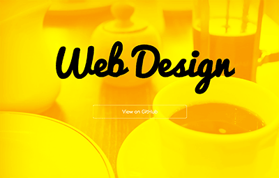

# Mini Web
WEBとグラフィック、双方のデザインスキルを伸ばすテンプレート教材。

## Sample
[Sample Website](http://designless.github.io/mini_web/)

### Level 1
テンプレートを改変する。

1. Download後、zipを展開してテキストエディタで開く。
2. テーマを決める(例:カフェ)
3. cafe.jpgをテーマに合った画像に差し替える([Public Domain Photo](https://pixabay.com/ja/))
4. 背景の色を変える
5. [Google Web Font](https://www.google.com/fonts)からフォントを探して変更する
6. ボタンのリンク先と、リンクの文字を差し替える
7. テーマに沿ったWEBサイトになったら、OK

### Level 2
0からMini Webを作る。

1. テーマ設定
2. 画像とフォント決め
3. コーディング
4. ここまで5分で作りきる
